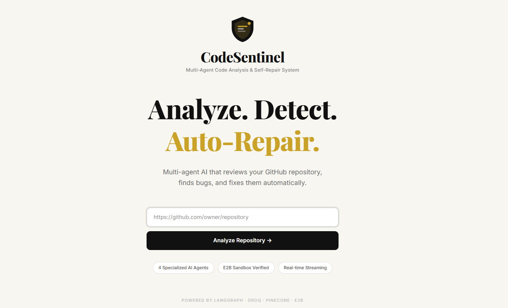

<div align="center">

# CodeSentinel 🛡️

## Multi-Agent Autonomous Code Review and Self-Debugging System

[](https://code-sentinel2.vercel.app/)

</div>


A full-stack AI-powered code review system built with FastAPI and React. Point CodeSentinel at any public GitHub repository, and it deploys a pipeline of specialized AI agents to detect bugs, audit security vulnerabilities, assess documentation quality, and measure code health — then synthesizes everything into a structured report with suggested fixes, streamed live to your browser.


---

## 📸 Demo Preview

### 🏠 Homepage
<a href="assets/Homepage.png">
  
</a>

---

### 🤖 Agent Pipeline
<a href="assets/Agent%20Pipeline.png">
  
</a>

---

### 📊 Repo Overview
<a href="assets/Repo%20Overview.png">
  
</a>

---

### 🐞 Bugs & Fixes
<a href="assets/Bugs%20%26%20Fixes.png">
  
</a>

---

## ✨ Key Highlights

- Built a full-stack multi-agent code review system using FastAPI, LangGraph, and React
- Orchestrator and Planner agents use Groq (Llama 3.3 70B) to understand the repository and intelligently route analysis to the right specialist agents
- 4 specialist agents run in a sequential pipeline: Bug Detector, Security Auditor, Documentation Checker, and Code Quality Analyzer
- Integrated tree-sitter for accurate AST-based parsing of Python, JavaScript, and TypeScript — extracts functions, imports, and docstring coverage across the whole repo
- Used Pinecone as a vector store and a HuggingFace CrossEncoder reranker to surface the most relevant code chunks for each agent
- Fixer agent attempts to auto-repair detected bugs using E2B sandboxed execution (Python/JS) or LLM reflection (JSX/TSX) — up to 3 attempts per bug
- Documentation score combines inline docstring/JSDoc coverage (70%) with README completeness across 6 key sections (30%)
- Streamed live agent progress to the frontend via Server-Sent Events (SSE) — each agent's status updates in real time
- Integrated LangSmith for full tracing of every LLM call and agent run across the pipeline
- Designed a premium dark editorial UI with Framer Motion animations and glass-card components

---

## 🎯 Use Cases

- Audit any public GitHub repository for bugs, security vulnerabilities, and code quality issues before merging or deploying
- Get an automated documentation health check — which functions lack docstrings, how complete is the README
- Identify the longest, most complex functions that should be refactored
- Detect hardcoded secrets, missing input validation, and other common security anti-patterns
- Auto-fix detected bugs in a sandboxed environment and review the diffs before applying them

---

## 🧠 Architecture

```
┌─────────────────────────────────────────────────────────────┐
│                      React Frontend                          │
│  (Landing · Live Agent Timeline · Tabbed Results Report)     │
└──────────────────────────┬──────────────────────────────────┘
                           │ SSE Stream (POST /review)
┌──────────────────────────▼──────────────────────────────────┐
│                     FastAPI Backend                          │
│                                                              │
│  ┌──────────────────────────────────────────────────────┐   │
│  │                LangGraph Pipeline                    │   │
│  │                                                      │   │
│  │  GitHub URL                                          │   │
│  │    → Fetcher      — downloads all repo files         │   │
│  │    → Parser       — tree-sitter AST extraction       │   │
│  │    → Embedder     — sentence-transformers vectors     │   │
│  │    → Vector Store — upsert chunks to Pinecone        │   │
│  │    → Orchestrator — Groq repo-level summary          │   │
│  │    → Planner      — Groq decides which agents to run │   │
│  │    → Bug Detector — Pinecone search + Groq analysis  │   │
│  │    → Fixer        — E2B sandbox or LLM reflection    │   │
│  │    → Security     — Pinecone search + Groq audit     │   │
│  │    → Doc Checker  — parser stats + README assessment │   │
│  │    → Code Quality — Pinecone search + Groq review    │   │
│  │    → Synthesizer  — Groq executive summary + report  │   │
│  └──────────────────────────────────────────────────────┘   │
└─────────────────────────────────────────────────────────────┘
```

**Agent responsibilities:**

| Agent | Role |
|-------|------|
| **Orchestrator** | Makes one Groq call to produce a high-level summary of the repo: project type, tech areas, key structural concerns |
| **Planner** | Reads the Orchestrator summary and parser stats, then decides which of the 4 specialist agents to activate and with what specific focus |
| **Bug Detector** | Generates 5 targeted Pinecone queries, reranks results with CrossEncoder, analyzes the top 10 chunks for logic errors, async mistakes, null risks, and off-by-one errors |
| **Fixer** | For each detected bug with a suggested fix: runs the fix in an E2B Python or Node sandbox (up to 3 attempts); falls back to LLM reflection for JSX/TSX files |
| **Security Auditor** | Runs 5 focused queries + 1 broad secrets sweep against Pinecone, reranks, then analyzes all unique chunks for hardcoded secrets, injection risks, and auth bypasses |
| **Doc Checker** | Counts undocumented functions from parser output, runs a Groq call for findings, then separately assesses README completeness across 6 sections |
| **Code Quality** | Generates 5 quality-focused Pinecone queries, reranks, then flags naming issues, long functions, deep nesting, magic numbers, and duplications — also runs a pure-Python analysis using tree-sitter line numbers for accurate function lengths |
| **Synthesizer** | Takes all agent outputs and calls Groq once to produce an executive summary, health score, top priorities, and overall verdict |

**Retry logic in the Fixer:** each bug attempt runs the fixed code in a sandbox and checks for errors. If the fix fails, the agent revises it and retries — up to 3 times. Fixes that pass sandbox execution are marked `fixed`; others are marked `reflect` (LLM-validated only).

---

## 📁 Project Structure

```
code-review-debug/
│
├── api/
│   └── main.py                  ← FastAPI server — SSE streaming, all endpoints
│
├── core/
│   ├── llm.py                   ← Groq LLM singleton + rate-limited invocation wrapper
│   ├── graph.py                 ← LangGraph StateGraph — wires all nodes into pipeline
│   ├── fetcher.py               ← GitHub file fetching via PyGithub
│   ├── parser.py                ← tree-sitter AST parser for Python, JS, TS
│   ├── embedder.py              ← Chunk creation + sentence-transformers embeddings
│   ├── vector_store.py          ← Pinecone upsert and search operations
│   ├── reranker.py              ← HuggingFace CrossEncoder reranking
│   │
│   └── agents/
│       ├── orchestrator.py      ← Repo-level summary (1 Groq call)
│       ├── planner.py           ← Agent activation and focus planning (1 Groq call)
│       ├── bug_detector.py      ← Bug detection (2 Groq calls: query gen + analysis)
│       ├── fixer.py             ← Automated bug fixing via E2B sandbox or LLM reflection
│       ├── security_auditor.py  ← Security audit (2 Groq calls: query gen + analysis)
│       ├── doc_checker.py       ← Documentation analysis (2 Groq calls: findings + README)
│       ├── code_quality.py      ← Code quality analysis (2 Groq calls + pure-Python checks)
│       └── synthesizer.py       ← Final report synthesis (1 Groq call)
│
├── frontend/
│   ├── index.html
│   ├── package.json
│   ├── vite.config.js           ← Vite dev server
│   └── src/
│       ├── App.jsx              ← Root component + routing
│       ├── pages/
│       │   ├── LandingPage.jsx  ← Hero, feature highlights, how-it-works
│       │   └── ResultsPage.jsx  ← Live agent timeline + tabbed results report
│       ├── components/
│       │   ├── AgentTimeline.jsx    ← Live agent step visualization with status
│       │   ├── BugCard.jsx          ← Bug card with diff viewer + fix mode badges
│       │   ├── CircularScore.jsx    ← Animated radial score gauge
│       │   ├── DiffViewer.jsx       ← Side-by-side code diff for bug fixes
│       │   ├── LiveLog.jsx          ← Real-time SSE event log
│       │   ├── ParticleBackground.jsx
│       │   ├── ResultsTabs.jsx      ← Tabbed view: Bugs · Security · Quality · Docs
│       │   └── StatCards.jsx        ← Key metrics (bugs, vulns, score, fixes)
│       └── hooks/
│           └── useSSEStream.js  ← Custom hook for SSE progress streaming
│
├── review_output/               ← Generated JSON reports saved here
├── run.py                       ← API launcher (uvicorn on port 8001)
├── main.py                      ← Standalone CLI entry point
├── requirements.txt             ← Python dependencies
├── .env.example                 ← API keys template
└── README.md
```

---

## 🛠️ Tech Stack

**Frontend**
- React 19 + Vite 8
- Tailwind CSS v4 — glass-card components, dark editorial palette
- Framer Motion — page transitions, live agent timeline animations
- react-diff-viewer-continued — side-by-side code diffs for bug fixes
- Lucide React — icon set
- Axios — API calls to backend

**Backend**
- FastAPI + Uvicorn
- LangGraph — StateGraph that orchestrates the full 12-node analysis pipeline
- LangChain + langchain-groq — LLM integration and prompt management
- LangSmith — tracing and observability for every LLM call and agent run

**AI Model**
- Groq `llama-3.3-70b-versatile` — all LLM calls: query generation, bug analysis, security audit, documentation review, code quality review, executive summary (~10 calls per review)
- HuggingFace `cross-encoder/ms-marco-MiniLM-L-6-v2` — semantic reranking of Pinecone search results

**Code Analysis**
- tree-sitter (Python, JavaScript, TypeScript grammars) — AST parsing for accurate function extraction, docstring detection, and line number tracking
- sentence-transformers — local embeddings for code chunk vectorization

**Infrastructure**
- Pinecone — vector database for code chunk storage and semantic search
- E2B Code Interpreter — sandboxed Python and Node.js execution for the Fixer agent
- PyGithub — GitHub API access for fetching repository files

---

## 🚀 Getting Started

### Prerequisites

- Python 3.10+
- Node.js 18+
- A free [Groq API key](https://console.groq.com) — powers all LLM calls
- A free [Pinecone account](https://app.pinecone.io) — vector storage and search
- A [GitHub Personal Access Token](https://github.com/settings/tokens) — for fetching repo files (no scopes needed for public repos)
- Optional: [E2B API key](https://e2b.dev) — enables sandboxed code execution in the Fixer agent (falls back to LLM reflection if not set)
- Optional: [LangSmith API key](https://smith.langchain.com) — enables tracing of every LLM call

---

## Setup

### 1. Backend Setup

#### Create and activate a virtual environment

**Windows:**
```bash
python -m venv venv
venv\Scripts\activate
```

**Mac/Linux:**
```bash
python3 -m venv venv
source venv/bin/activate
```

You should see `(venv)` at the start of your terminal line.

#### Install dependencies

```bash
pip install -r requirements.txt
```

> On first run, the HuggingFace CrossEncoder model will download automatically and cache locally. This takes a minute once only.

#### Set up Pinecone

1. Go to [app.pinecone.io](https://app.pinecone.io) and create a free account
2. Create an index with the following settings:
   - **Dimensions:** `384`
   - **Metric:** `cosine`
   - **Index name:** anything you like (e.g. `codesentinel`)
3. Copy your API key from the Pinecone dashboard

#### Create the `.env` file

Create a file named `.env` in the project root (same folder as `run.py`):

```
GITHUB_TOKEN=your_github_token_here
PINECONE_API_KEY=your_pinecone_api_key_here
GROQ_API_KEY=your_groq_api_key_here
E2B_API_KEY=your_e2b_api_key_here

LANGCHAIN_TRACING_V2=true
LANGCHAIN_API_KEY=your_langsmith_api_key_here
LANGCHAIN_PROJECT=codesentinel
```

> Get your Groq key at: https://console.groq.com → API Keys
> Get your Pinecone key at: https://app.pinecone.io → API Keys
> Create a GitHub token at: https://github.com/settings/tokens

#### Run the backend

```bash
python run.py
```

Backend runs at: **http://localhost:8001**
API docs at: **http://localhost:8001/docs**

---

### 2. Frontend Setup

Open a **new terminal window:**

```bash
cd frontend
npm install
npm run dev
```

Frontend runs at: **http://localhost:5173**

Open **http://localhost:5173** in your browser.

---

**Every time you come back to the project:**
1. Terminal 1 → activate venv → `python run.py`
2. Terminal 2 → `cd frontend` → `npm run dev`
3. Open `http://localhost:5173`

---

## 🖥️ Usage

1. Paste any public GitHub repository URL into the input field and click **Analyze**
2. Watch the live agent pipeline — Fetch → Parse → Embed → Orchestrate → Plan → Bug Detect → Fix → Security → Docs → Quality → Synthesize
3. Once complete, the results page opens with four tabs:
   - **Bug Fixes** — detected bugs with original code, suggested fix, diff view, and sandbox execution status
   - **Security** — vulnerabilities with severity, affected code, and plain-English explanation of the attack vector
   - **Code Quality** — quality issues by type, longest functions list, and overall quality score
   - **Documentation** — docstring coverage, README completeness checklist, and blended documentation score
4. The top of the results page shows the overall health score, executive summary, and key stats

---

## 📡 API Endpoints

| Method | Endpoint | Description |
|--------|----------|-------------|
| GET | `/health` | Check if backend is alive |
| POST | `/review` | Start a new review — returns `review_id` immediately |
| GET | `/review/{review_id}/stream` | SSE stream of live progress events |
| GET | `/review/{review_id}/report` | Fetch the final structured JSON report |

**Example: start a review**
```bash
curl -X POST http://localhost:8001/review \
  -H "Content-Type: application/json" \
  -d '{"repo_url": "https://github.com/owner/repo"}'
```

**Example: stream progress**
```bash
curl -N http://localhost:8001/review/{review_id}/stream
```

---

## 🔑 Environment Variables

Create a `.env` file in the project root with:

```
GITHUB_TOKEN=your_github_token_here
PINECONE_API_KEY=your_pinecone_api_key_here
GROQ_API_KEY=your_groq_api_key_here
E2B_API_KEY=your_e2b_api_key_here
LANGCHAIN_TRACING_V2=true
LANGCHAIN_API_KEY=your_langsmith_api_key_here
LANGCHAIN_PROJECT=codesentinel
```

| Variable | Required | Description | Get it here |
|----------|----------|-------------|-------------|
| `GITHUB_TOKEN` | Yes | GitHub Personal Access Token — fetches repo files | https://github.com/settings/tokens |
| `PINECONE_API_KEY` | Yes | Pinecone vector database — stores and searches code chunks | https://app.pinecone.io |
| `GROQ_API_KEY` | Yes | Groq API — powers all LLM calls via Llama 3.3 70B | https://console.groq.com |
| `E2B_API_KEY` | Optional | E2B sandbox — enables live code execution for the Fixer agent | https://e2b.dev |
| `LANGCHAIN_TRACING_V2` | Optional | Set to `true` to enable LangSmith tracing | — |
| `LANGCHAIN_API_KEY` | Optional | LangSmith API key for tracing | https://smith.langchain.com |
| `LANGCHAIN_PROJECT` | Optional | LangSmith project name (e.g. `codesentinel`) | — |

> Never commit your `.env` file — it contains secret API keys. Add it to `.gitignore`.

---

## 📝 Notes

- **Pinecone index dimensions must be 384** — this matches the `all-MiniLM-L6-v2` sentence-transformers model used for embeddings. Using a different dimension will cause upsert errors.
- **Groq rate limits** — each review makes approximately 10 LLM calls. A 1.5-second sleep between calls is built in to stay within Groq's free tier limits.
- **E2B sandbox** — only `.py` and `.js`/`.mjs` files are executed in the sandbox. JSX, TSX, and other file types automatically fall back to LLM reflection mode, shown as "AI Validated" in the UI.
- **GitHub token scopes** — no special scopes are needed for public repositories. For private repos, enable the `repo` scope on your token.
- **HuggingFace CrossEncoder** — the reranker model downloads once on first run and is cached automatically. No HuggingFace account or API key is required.
- **LangSmith is fully optional** — if `LANGCHAIN_TRACING_V2` is not set or set to `false`, tracing is completely disabled with zero overhead. All `@traceable` decorators become no-ops.
- The `venv/` directory and `.env` file should be excluded from Git via `.gitignore`.
